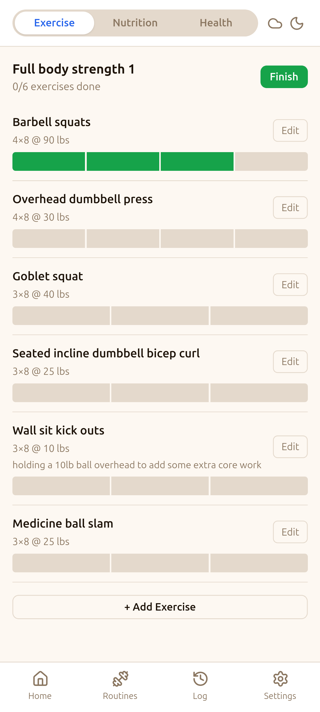
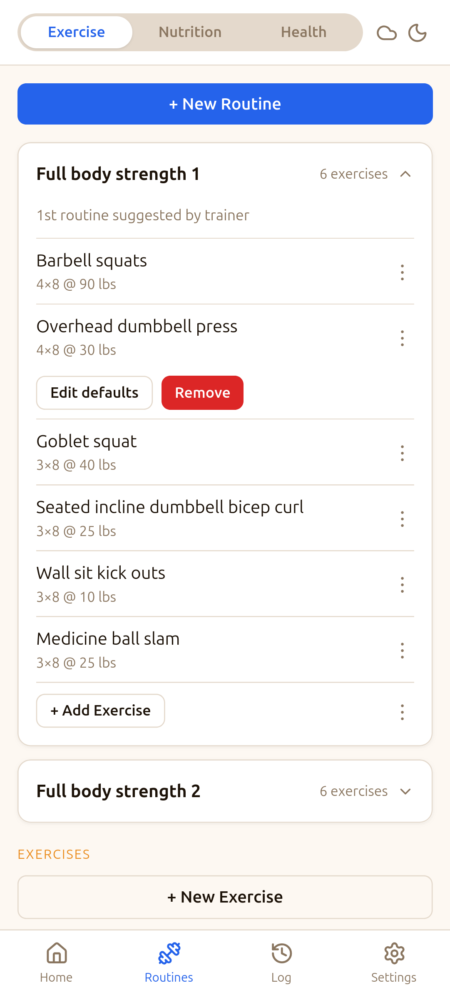
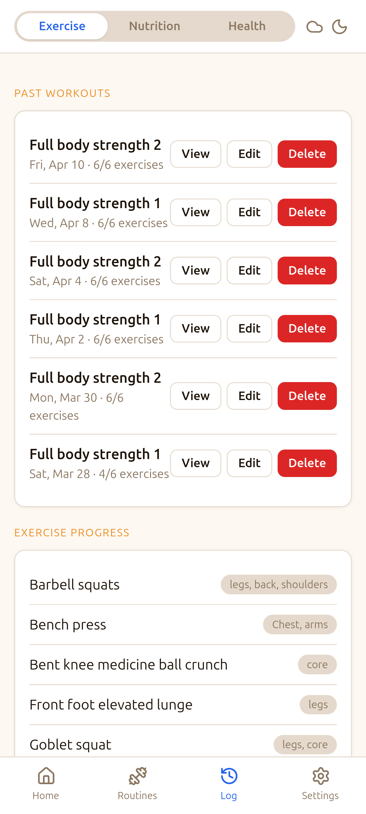
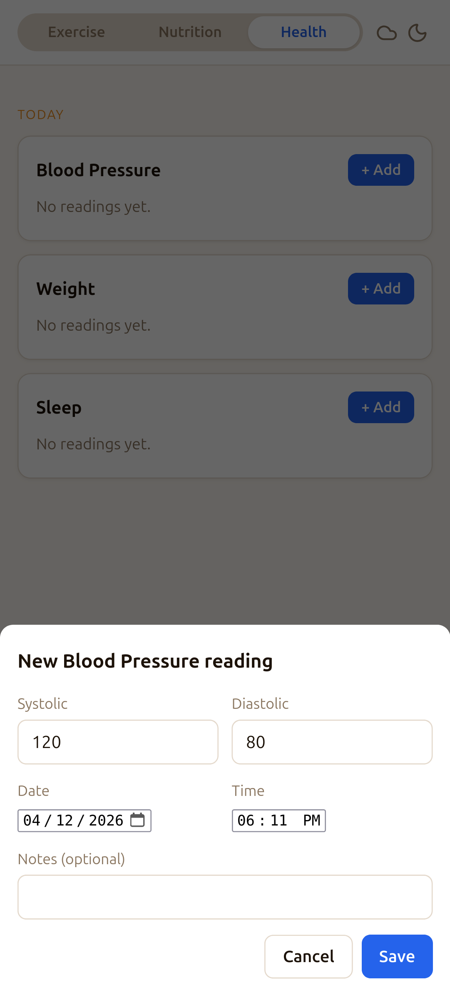

# SimpleFit

A lightweight, mobile-first PWA for tracking workouts and health metrics. Runs entirely in the browser — no server, no account required. Data lives in your browser's IndexedDB and can be backed up to Google Drive.

SimpleFit is organized into modes — switch between them using the segmented control in the header:

- **Exercise** — routines, workouts, progress charts
- **Health** — blood pressure, weight, sleep, and custom metrics (manual entry)
- **Nutrition** — placeholder (coming soon)

## Screenshots

<table>
  <tr>
    <td></td>
    <td></td>
    <td></td>
    <td></td>
  </tr>
  <tr>
    <td align="center">Active Workout</td>
    <td align="center">Routines</td>
    <td align="center">Log</td>
    <td align="center">Health</td>
  </tr>
</table>

---

## Features

**Exercise**
- Define reusable **routines** composed of exercises with default sets, reps, and weight
- **Per-set progress tracking** — a segmented progress bar for each exercise lets you tap to mark individual sets complete
- **Timed exercise support** — exercises can be weight/reps-based or duration-based (e.g. planks, runs) with an in-app countdown timer that auto-completes the set and fires a system notification when done
- Edit sets, reps, weight, or duration inline mid-workout, with an option to **update routine defaults** from the new values
- Add exercises on the fly during a session
- View **exercise history** with a weight-over-time chart
- Browse a **session log** of past workouts

**Health**
- Track **Blood Pressure** (systolic/diastolic), **Weight**, **Sleep**, and any custom metric you define
- Each reading records date and time (defaults to now, editable)
- Per-metric log view with edit and delete
- Custom metrics can be numeric, dual-value (like BP), or duration-based

**General**
- **Google Drive backup/restore** — syncs a single JSON file to your Drive's hidden app data folder
- **Local JSON export/import** as a manual backup fallback
- Installable on Android (and iOS) as a home screen app via PWA

---

## Deployment

The app is hosted on GitHub Pages and deployed automatically via GitHub Actions on every push to `main`. No build step is required — it's plain HTML, CSS, and JavaScript.

To deploy your own copy:

1. Fork or clone this repository
2. Go to **Settings → Pages → Source** and select **GitHub Actions**
3. Push to `main` — the deploy workflow will run and publish the `public/` directory

---

## Google Drive Backup Setup

Drive backup uses OAuth 2.0. You need a Google Cloud project with the Drive API enabled and an OAuth Client ID scoped to your Pages URL.

### 1. Create OAuth credentials

1. Go to [Google Cloud Console](https://console.cloud.google.com/) and open your project (or create one)
2. Navigate to **APIs & Services → Library**, search for **Google Drive API**, and enable it
3. Go to **APIs & Services → Credentials → Create Credentials → OAuth client ID**
4. Choose **Web application**
5. Under **Authorized JavaScript origins**, add your GitHub Pages URL:
   ```
   https://<your-username>.github.io
   ```
6. Click **Create** and copy the **Client ID**

### 2. Configure the app

1. Open the app and tap **Settings**
2. Paste your Client ID into the **Google OAuth Client ID** field and tap **Save Client ID**
3. Tap **Sign in to Google** and complete the OAuth flow
4. Tap **Backup Now** to create your first backup

Backups are stored in your Google Drive's hidden **App Data** folder — they won't appear in your regular Drive file list.

> **Note:** If you clear your browser data or switch devices, use **Restore from Drive** after signing in to recover your data.

---

## Usage

### Building your routine library

1. Tap **Routines** → **New Routine**
2. Give the routine a name (e.g. "Push Day") and optional notes
3. Tap **+ Add Exercise** on the routine card
4. Select an existing exercise or create a new one — choose **Weight/Reps** or **Timed** as the exercise type
5. Default sets, reps (or duration), and weight start at 3 × 10 @ 0 lbs (or 3 × 0:60 for timed) — you can update these during a workout and save the new defaults

### Starting a workout

1. Tap **Home** and press **Start** next to a routine
2. Work through your exercises — tap segments of the set progress bar to mark individual sets complete
3. For timed exercises, tap **Start** to begin the countdown timer — it auto-completes the set when it finishes
4. Tap **Edit** on any exercise to adjust sets, reps, weight, or duration for this session — you'll be offered the option to update the routine defaults
5. Tap **+ Add Exercise** to add something not in the routine
6. When you're done, tap **Finish** — the session is saved to your log

### Viewing progress

- Tap **Log** to see past sessions
- Tap any session to see the full exercise breakdown
- Scroll down to **Exercise Progress** and tap an exercise to see a weight-over-time chart and full session history for that movement

### Tracking health metrics

1. Switch to **Health** mode using the segmented control in the header
2. Blood Pressure, Weight, and Sleep are pre-loaded — tap **+ Add** on any card to record a reading
3. The reading form shows date and time (defaults to now) — adjust if logging retroactively
4. Tap a metric name to see its full chronological log; tap any entry to edit or delete it
5. To add a custom metric, tap **Metrics** → **+ New Metric**, choose a name, type, and unit

### Backing up and restoring

**Google Drive (recommended):**
- Sign in once via Settings, then tap **Backup Now** any time
- To sync to a new device: install the app, configure your Client ID in Settings, sign in, then tap **Restore from Drive**

**Local JSON:**
- Tap **Download JSON** in Settings to save a backup file to your device
- Tap **Import JSON** to restore from a previously exported file

---

## Installing on Android

1. Open the app URL in Chrome on your Android device
2. Tap the browser menu (⋮) → **Add to Home Screen**
3. The app will launch full-screen from your home screen and work offline
